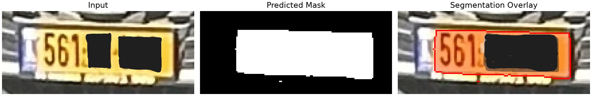
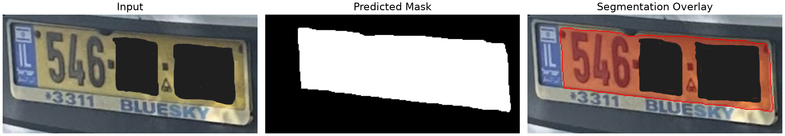
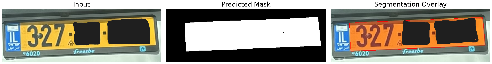
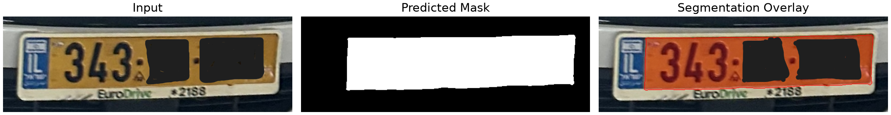
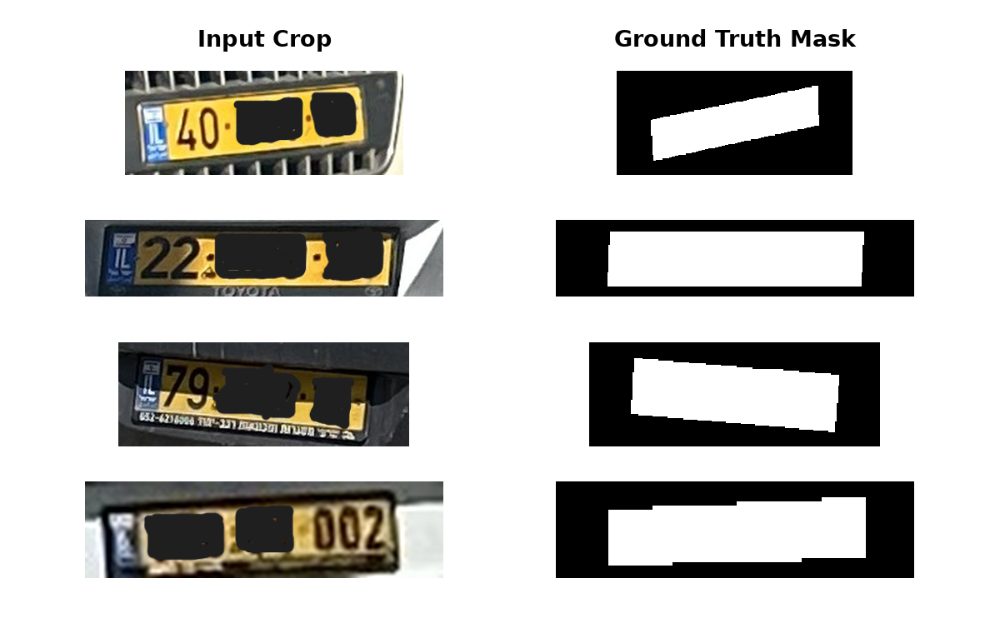

# Israeli License Plate Segmentation

Binary semantic segmentation of Israeli yellow license plates using a
**U-Net** with an **ImageNet-pretrained ResNet34 encoder**.

This project covers the complete segmentation workflow: manual
annotation, dataset construction, controlled experiments, failure
analysis, model selection, held-out test evaluation, and inference on
unseen plate crops.

**Final held-out Test IoU: 0.9684 \| Dice: 0.9839**

------------------------------------------------------------------------

## Qualitative Results on Unseen Images

These newly collected plate crops were **not included in the training, validation, or test sets**. Each panel shows the input crop, predicted binary mask, and segmentation overlay.









------------------------------------------------------------------------

## Problem

This project focuses on one component of a larger license-plate vision pipeline.

The goal of the segmentation model is **not to detect a license plate in a full vehicle image**. A plate detector first provides a localized crop, and the segmentation model then extracts the precise yellow plate region at the pixel level.

```text
Vehicle Image
      ↓
Plate Detection
      ↓
Plate Crop
      ↓
Yellow Plate Segmentation
      ↓
Plate Boundary / Geometry
      ↓
Classical Computer Vision
```

This separation is useful because license plates provide a geometrically meaningful object with known physical dimensions and a fixed aspect ratio. Once the plate region is accurately segmented, classical computer-vision techniques can use its geometry for tasks such as boundary and corner extraction, homography estimation, perspective rectification, and pose or distance estimation.

The segmentation model therefore acts as a **learned front end for downstream geometric processing**. It replaces brittle color-based segmentation with a model that can better handle variations in illumination, blur, shadows, reflections, and perspective, while leaving the geometric reasoning to explicit computer-vision methods.

The learning task itself is **binary semantic segmentation**:

```text
Plate Crop → Segmentation Model → Binary Plate Mask
```

The model is intentionally trained on **plate-centered crops rather than arbitrary full-vehicle images**. This keeps the learning problem focused on precise plate-region extraction instead of combining plate detection and segmentation into a single task.
------------------------------------------------------------------------

## Dataset

The final dataset contains **606 manually annotated license-plate crops**.

| Split | Samples |
| --- | ---: |
| Train | 424 |
| Validation | 91 |
| Test | 91 |
| **Total** | **606** |

The dataset contains variation in plate size, viewing angle, blur, illumination, shadows, and surrounding vehicle appearance. Annotations were created using a custom polygon annotation tool and converted into plate-centered crops with binary masks.

### Dataset Examples

Below are representative examples of the plate crops and their corresponding manually annotated ground-truth masks.



The final test set remained untouched during model development and model selection.

------------------------------------------------------------------------

## Data Pipeline

``` text
Raw Images
    ↓
Manual Polygon Annotation
    ↓
Plate Crops + Binary Masks
    ↓
Train / Validation / Test Split
    ↓
Optional Training Augmentation
    ↓
Aspect-Ratio-Preserving Letterbox Resize
    ↓
ImageNet Normalization
    ↓
PyTorch Dataset / DataLoader
    ↓
Segmentation Model
```

Images are resized using letterboxing to preserve aspect ratio. Masks
use nearest-neighbor interpolation to preserve binary labels.

------------------------------------------------------------------------

## Final Model

  Component                Configuration
  ------------------------ --------------------------
  Architecture             U-Net
  Encoder                  ResNet34
  Encoder initialization   ImageNet pretrained
  Input resolution         **256 × 768**
  Output                   Binary segmentation mask
  Loss                     BCE + Dice
  Optimizer                AdamW
  Batch size               4
  Inference threshold      0.5
  Training augmentation    None

### Training Schedule

**Phase 1 --- frozen encoder:** 5 epochs, learning rate `1e-3`.

**Phase 2 --- full fine-tuning:** 30 epochs, learning rate `1e-4`.

The final configuration was selected using the validation set **before
evaluating on the held-out test set**.

------------------------------------------------------------------------

## Controlled Experiments

The main experiment families included dataset size, input resolution,
batch size, loss function, learning-rate scheduling, encoder
freezing/fine-tuning, data augmentation, encoder size, and segmentation
architecture.

Most changes to batch size, loss, scheduling, fine-tuning strategy, and
architecture produced only small differences. Two factors produced the
clearest signals: **more training data** and **higher input
resolution**.

------------------------------------------------------------------------

## Data Scaling

Models were trained on nested subsets of the same training split while keeping the **same 91-image validation set** and the same training recipe.

| Training Samples | Validation IoU |
| ---: | ---: |
| 175 | 0.9638 |
| 250 | 0.9665 |
| 350 | 0.9675 |
| **424** | **0.9681** |

Performance improved monotonically as more training data was added, although the gains showed diminishing returns.

For the same 10 hardest validation examples identified by the 175-sample model:

| Training Samples | Mean IoU on Hardest 10 |
| ---: | ---: |
| 175 | 0.9239 |
| 250 | 0.9393 |
| 350 | 0.9414 |
| **424** | **0.9444** |

While the overall validation IoU improved by **+0.0043**, performance on these difficult examples improved by **+0.0205**.

This suggests that additional training data was especially valuable for improving robustness on difficult cases, even after the average validation performance had begun to saturate.

------------------------------------------------------------------------

## Resolution Study

Input resolution was one of the few model-side changes that produced a consistent improvement.

| Input Resolution | Validation IoU |
| :--- | ---: |
| 64 × 192 | 0.9659 |
| 128 × 384 | 0.9681 |
| **256 × 768** | **0.9690** |

Higher input resolution consistently improved segmentation performance. Based on this result, **256 × 768** was carried forward to final model selection.

---

## Final Model Selection

The strongest candidates were compared in the **original crop coordinate system**. Each model was evaluated at its trained resolution, and its probability map was then mapped back to the original image dimensions.

| Model | Resolution | Mean Validation IoU |
| :--- | :---: | ---: |
| Baseline | 128 × 384 | 0.9642 |
| High Resolution | 256 × 768 | 0.9709 |
| High Resolution + Augmentation | 256 × 768 | 0.9710 |

High resolution produced a clear improvement over the baseline. Adding augmentation on top of the high-resolution model improved mean IoU by only **+0.0001**, slightly reduced median IoU, and improved fewer than half of the validation samples.

The selected final model was therefore:

> **U-Net + ResNet34 at 256 × 768, without training augmentation.**

This decision was made **before evaluating on the held-out test set**.

------------------------------------------------------------------------

## Held-Out Test Results

The selected model was evaluated on the **91-image held-out test set**.

  Metric                 Result
  ---------------- ------------
  Mean IoU           **0.9684**
  Median IoU         **0.9722**
  Mean Dice          **0.9839**
  Median Dice        **0.9859**
  Mean Precision     **0.9813**
  Mean Recall        **0.9867**

Validation IoU was approximately **0.9690** and Test IoU was **0.9684**,
showing very similar performance on held-out data.

### Test IoU Distribution

-   98.9% of samples achieved IoU ≥ 0.90
-   94.5% achieved IoU ≥ 0.94
-   93.4% achieved IoU ≥ 0.95
-   84.6% achieved IoU ≥ 0.96
-   58.2% achieved IoU ≥ 0.97


------------------------------------------------------------------------

## Inference

`inference.py` runs the final pipeline on a new **plate-centered crop**.

``` bash
python inference.py --image path/to/plate.jpg --checkpoint checkpoints/resolution_high_v3/best_model.pt --output prediction_mask.png
```

The script letterboxes the crop to **256 × 768**, applies ImageNet
normalization, runs U-Net + ResNet34, applies sigmoid and a `0.5`
threshold, restores the mask to the original crop dimensions, and saves
both the binary mask and a visualization panel:

``` text
Input | Predicted Mask | Segmentation Overlay
```

> **Note:** model checkpoints and the full image dataset are not tracked
> in Git because of their size. Train the desired experiment locally or
> provide a compatible checkpoint when running inference.
>
> **Model weights:** Trained checkpoints are not included in this repository due to file size.  
> If you would like to obtain the weights for the final model, feel free to contact me at st.ariel100@gmail.com.

------------------------------------------------------------------------

## Repository Structure

``` text
plate_processing/
├── analysis/               # Experiment comparison and failure analysis
├── data/                   # Split CSVs; images and masks ignored by Git
├── scripts/
│   ├── annotate_zoom.py
│   ├── build_dataset.py
│   └── visualize_dataset.py
├── training/
│   ├── augmentations/
│   ├── configs/
│   ├── create_split.py
│   ├── dataset.py
│   ├── losses.py
│   ├── metrics.py
│   ├── model.py
│   └── train.py
├── inference.py
├── requirements.txt
└── README.md
```

------------------------------------------------------------------------

## Training

Install dependencies:

``` bash
pip install -r requirements.txt
```

Run the final high-resolution experiment:

``` bash
python training/train.py --experiment resolution_high_v3
```

Other controlled experiments use the same configuration system, for
example:

``` bash
python training/train.py --experiment scaling_250_v3
```

Checkpoints are saved under
`checkpoints/<experiment_name>/best_model.pt`.

------------------------------------------------------------------------

## Key Takeaways

-   **Data mattered more than extensive hyperparameter tuning.**
    Increasing the training set produced consistent improvements and
    substantially improved difficult samples.
-   **Resolution mattered.** Moving from 128 × 384 to 256 × 768 produced
    one of the clearest and most repeatable model-side improvements.
-   **Most training modifications had limited impact.** Batch size,
    losses, scheduling, fine-tuning strategy, augmentation, and
    architecture generally remained within a narrow performance range.
-   **Remaining errors are mostly local.** The final model generally
    finds the plate correctly; residual errors are dominated by
    boundaries, adjacent yellow regions, and a small number of degraded
    plate crops.

------------------------------------------------------------------------

## Tech Stack

**Python · PyTorch · segmentation-models-pytorch · OpenCV ·
Albumentations · NumPy · Pandas · Matplotlib**
